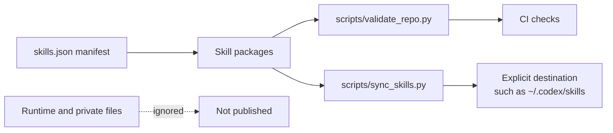

# Repository Architecture

This repository is the source of truth for a small collection of Codex skills. It is a package registry plus validation and synchronization tooling; it is not a runtime workspace and it does not publish user data.

## Source of truth

- `skills.json` is the registry. Each entry names one root-level package, its version, language, category, and dependencies.
- A skill package is self-contained: `SKILL.md` is the instruction entry point; `agents/openai.yaml` is published UI metadata; `examples/` contains at least one representative case; `references/`, `scripts/`, and `assets/` are optional.
- `scripts/validate_repo.py` checks the registry and package contract without third-party dependencies.
- `scripts/sync_skills.py` compares or explicitly copies registered packages using SHA-256 and never deletes destination-only files.
- `.taskflow/`, `.grepai/`, `node_modules/`, `Users/`, caches, temporary inspection files, and generated weekly reports are local runtime state and are excluded from publication.

## Package boundaries

Keep each skill at the repository root so the existing `npx skills add ... --skill <name>` workflow remains compatible. Do not place private project-specific data under a published package. Long variant-specific guidance belongs in `references/`; deterministic repeated logic belongs in `scripts/`.

## Change flow

1. Update or add a package and its manifest entry.
2. Run the strict repository validator.
3. Run the relevant package smoke test and repository regression tests.
4. Review the diff and generated-file boundary.
5. Use `sync_skills.py --check` for a read-only destination audit.
6. Use `sync_skills.py --apply` only when the destination is intentional, then run `--check` again.

Git commit, push, and PR creation are separate actions and are not performed by repository validation or synchronization.
